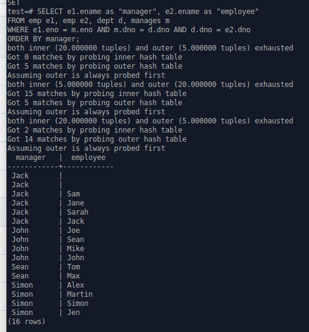

<h1 align="center"> CSI3130-Project Symmetric hash join </h1>  

Group Members
- Carlota  300334659
- Daniel   300176257
- Rakshita 300215340
- Rayan    300336355

This archive contains 5 main-files of the project files for the course CSI 3130, that is, this file (Readme.Txt),createplan.c, execnodes.h, nodeHash.c, and nodeHashjoin.c in which the changes were made to incorporate the symmetric hash join algorithm over any other.

<h1 align="center"> Problems Faced </h1>  

When executing the provided files, there was an error where the server crahsed as a result of the lines where a check for repeated tuples is performed in nodeHashJoin.c:
if (!node->outer_exhausted && !node->hj_NeedNewOuter && !TupIsNull(node->js.ps.ps_OuterTupleSlot) && ItemPointerGetBlockNumber(&curtuple->t_data->t_ctid) == ItemPointerGetBlockNumber(&node->js.ps.ps_OuterTupleSlot->tts_tuple->t_data->t_ctid)
					&& ItemPointerGetOffsetNumber(&curtuple->t_data->t_ctid) == ItemPointerGetOffsetNumber(&node->js.ps.ps_OuterTupleSlot->tts_tuple->t_data->t_ctid)) {
					//				printf("repeated tuple \n"); }

				
Specifically, &curtuple->t_data->t_ctid cannot be evaluated. This was addressed by modifying the manner in which the HeapTuple curtuple is obtained, so that ot is returned from a modified ExecScanHashBucket function in nodeHash.c rather than seperate ExecScanHashBucket_probeouter() and ExecScanHashBucket_probeinner() functions.
The result of the method needs to be type-cast to a HeapTuple. This allows a query using symmetric hash join to evaluate without a server crash occurring.  
			

<h1 align="center"> Results </h1>  

    
  </a>

 

